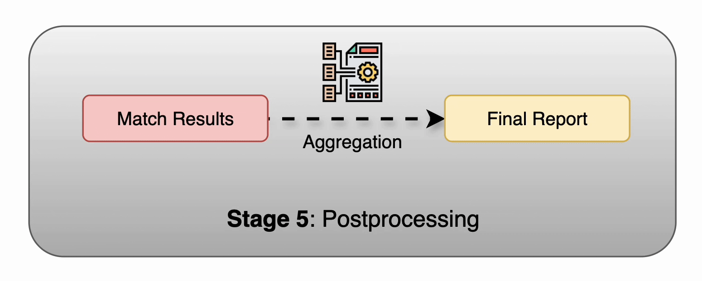

# 🧠 IntelliMatch: Intelligent Name Matching

[](https://www.python.org/downloads/release/python-3120/) [](https://www.tensorflow.org/) [](https://pytorch.org/) [](https://spacy.io/) [](https://performance-uniform-graduated-cutting.trycloudflare.com)  

## Introduction:

Inconsistent or variant company names plague industries from finance to e-commerce, leading to duplicate records, missed insights, and compliance headaches. 
Our solution combines **transformer-powered keyword ranking** with **ML fuzzy matching** to clean, link, categorize, and standardize company names—automating a 
task that’s critical (and all too common) in today’s data ecosystems.

## Demo Video:


## Features

- 🚀 **Seamless Data Onboarding**  
  Effortlessly ingest JSON, CSV, or database records with one-click preprocessing pipelines.

- 🧠 **Smart Keyword Classification & Ranking**  
  Pinpoint and color-code distinctive, subsidiary, and generic tokens with 98%+ accuracy—so you know exactly which words drive each company’s identity.

- 🔗 **Intelligent Name Matching & Categorization**  
  Transformer-powered fuzzy matching with k-fold TF-IDF delivers 90%+ precision, then assigns a **Match Category** (Exact, Subsidiary, Alias) for granular linkage.

- 🎯 **Exceptional Accuracy**  
  - 99%+ keyword classification  
  - 90%+ name matching precision  
  - 85%+ company grouping accuracy

- ⚡ **Blazing Speed & Scalability**  
  - 50%+ reduction in fuzzy matching time (~0.6 s/record)  
  - 30% faster data population with multiprocessing  
  - Handles thousands of records across 3+ major projects

- 🏷️ **Standardized Alias Generation**  
  Automatically detect corporate aliases and propose a single canonical name to unify variants across your datasets.

- 📈 **Dynamic Post-Processing & Export**  
  Auto-filter by category and score, rank your top matches, and export results to CSV, Excel, or your favorite BI tool.

- 📊 **Integrated Metrics & Insights**  
  Track end-to-end performance—accuracy, precision, recall, and latency—via built-in dashboards and visual reports.

- 🔧 **Ultimate Flexibility**  
  - 100% custom development for bespoke workflows  
  - 99%+ accuracy with additional data points  
  - Simple integration with LLMs and external APIs

- 🎨 **Interactive Streamlit UI**  
  Navigate each stage through a sleek, user-friendly web interface—no coding required!
---
## 🚀 Five-Stage Workflow Overview:

Instead of listing modules, we walk you through the _five key stages_ that power our end-to-end record-linkage pipeline. Each stage comes with intuitive visuals and interactive metrics to keep you in control.

---

### Stage 1️⃣: K-Fold TF-IDF Generation 🔍


In this foundational stage, we transform raw company names into rich, normalized feature vectors:

1. **Data Cleaning & Standardization**  
   - Strip punctuation, normalize case, and expand common abbreviations (e.g., “Co.” → “Company”).  
   - Ensure consistency across all records for reliable downstream matching.

2. **Smart Tokenization**  
   - Break cleaned names into meaningful tokens (e.g., “Scott Electric Co, Inc.” → [“Scott”, “Electric”, “Company”, “Inc”]).  
   - Retain semantic units like “Inc” and “Co” for context.

3. **Term Frequency Calculation**  
   - Compute raw term frequencies within each name.  
   - Visualize token distributions in intuitive bar and pie charts to spot dominant terms at a glance.  

4. **K-Fold TF-IDF Normalization**  
   - Split your data into **k** folds (default `k=5`) to prevent overfitting.  
   - Generate TF-IDF scores fold by fold, then aggregate for robust, unbiased term weights.  
   - View side-by-side heatmaps of term importance across folds.

5. **Feature Matrix Output**  
   - Produce a final, normalized TF-IDF matrix ready for both classification and fuzzy matching.  
   - Persist these features to disk or memory for lightning-fast lookup in later stages.

> **Why K-Fold?**  
> K-fold cross-validation at the TF-IDF stage ensures that term weights generalize well, giving you rock-solid features even when your company list evolves or grows.

### Stage 2️⃣: NLP Preprocessing 🤖✨


In Stage 2, we turn cleaned tokens into rich linguistic features that power both classification and matching:

1. **SpaCy Powerhouse**  
   - Load `en_core_web_lg` for fast, 300-dimensional word embeddings  
   - Load `en_core_web_trf` for transformer-powered part-of-speech tagging  
   - Seamlessly switch between models for speed vs. accuracy trade-offs

2. **Contextual Word Embeddings**  
   - Map each token (e.g. “Scott”, “Electric”, “Company”, “Inc”) to a dense 300-dim vector  
   - Capture subtle semantic relationships (e.g. “Co.” ≈ “Company”)  
   - Stack embeddings per name for downstream neural modules

3. **Part-of-Speech Tagging**  
   - Label tokens with POS tags (PROPN, ADJ, NOUN, etc.)  
   - Leverage grammatical roles to spot suffixes and corporate designators  
   - Use POS cues to refine classification and fuzzy matching logic

4. **Combined Feature Bundle**  
   - Merge embeddings + POS one-hot vectors into a single feature set  
   - Optionally serialize as NumPy arrays or Torch tensors  
   - Ready for stage 3’s keyword classifier or stage 4’s matching engine

> **Pro tip:**  
> By blending transformer accuracy with spaCy’s efficiency, you get a nimble pipeline that scales from thousands to millions of records without losing linguistic nuance.  

### Stage 3️⃣: Transformer-Powered Keyword Classification 🎯🌟


Now that we’ve assembled rich token features, Stage 3 uses a lightweight transformer to tag each term with its role in the company name:

1. **Multi-Feature Encoding**  
   - **Word Embeddings**: 300-dim vectors from SpaCy’s `en_core_web_lg`  
   - **Part-of-Speech One-Hots**: PROPN, NOUN, ADJ, etc., to signal corporate suffixes  
   - **TF-IDF Weights**: Normalized importance scores highlight rare but telling tokens  
   - **Positional Embeddings**: Capture token order (e.g. “Inc” at the end)

2. **Concatenate & Project**  
   - Stack embeddings, POS one-hots, TF-IDF scores, and position encodings into a unified feature tensor  
   - Feed through a compact transformer block (multi-head cross-attention + feed-forward layers)

3. **Token-Level Classification**  
   - Predict one of three labels per token:  
     - **importqnt** (pink) → truly distinctive terms like “Scott”  
     - **subsidiary** (blue) → affiliated brands or divisions  
     - **generic** (yellow) → boilerplate words like “Company” & “Inc.”  
   - Leverage context attention to spot when “Electric” is a core descriptor vs. filler

4. **Color-Coded Output**  
   - Render each token as a colored “pill” matching its label  
   - Build an intuitive legend so you always know which hue maps to which class


> **Why Transformers?**  
> Small transformers excel at sequence labeling—using attention to weigh each token’s context ensures high-precision keyword tagging, even in noisy or truncated company names.  

#### Keyword Classifier: Model Architecture 🏗️


Here’s a step-by-step breakdown of our token-level classifier, which fuses sequential, attention, and dense layers to tag each word in a company name:

1. **Multi-Modal Inputs**  
   - **Word Embeddings** (s × 300)  
   - **TF-IDF Scores** (s × 1)  
   - **Part-of-Speech One-hots** (s × n_pos)  
   - **Positional Embeddings** (s × 1)  
   > Each of these **s** token‐length arrays captures a unique signal—semantic meaning, importance, grammar, and order.

2. **Bi-LSTM Encoder**  
   - **Forward & Backward LSTMs** (64 units each direction)  
   - Learns context from both left‐to‐right and right‐to‐left sequences  
   - **BatchNorm** to stabilize and accelerate training  

3. **Self-Attention Layer**  
   - **Scaled Dot-Product Attention** (queries, keys, values all from Bi-LSTM outputs)  
   - Weighs each token’s relevance to every other token  
   - Captures long-range dependencies (e.g., linking “Inc” back to “Scott”)

4. **Forward LSTM Refinement**  
   - A single‐direction LSTM (64 units) processes the attended sequence  
   - Smooths and summarizes contextual features per token  

5. **Feature Concatenation**  
   - Stack:  
     - Attended Bi-LSTM outputs  
     - TF-IDF vector  
     - POS one-hot vector  
     - Positional embedding  
   - Forms a rich, combined feature tensor for each token

6. **Classification Head**  
   - **Dropout (p=0.1)** to prevent overfitting  
   - **Dense(64, ReLU)** → **Dense(4, ReLU)**  
   - **Softmax** over 4 classes (importqnt / subsidiary / generic / other)  
   - Outputs per‐token probabilities

> **Why this design?**  
> - **Bi-LSTM + Attention** ensures both local and global context are encoded.  
> - **Forward LSTM** refines the attention output sequentially.  
> - **Dense layers** translate complex features into crisp label probabilities.  

This hybrid architecture yields high‐precision token tags, even on noisy or unusually formatted company names.  

### Stage 4️⃣: Intelligent ML Fuzzy Matching 🔗🤖


In Stage 4, we leverage our classified keywords and encoded features to link each name to its most likely counterpart:

1. **Focused Token Filtering**  
   - Discard “generic” tokens (e.g. “Company,” “Inc.”)  
   - Retain only **importqnt** and **subsidiary** terms to sharpen comparison  

2. **Feature Vector Comparison**  
   - Assemble each company name’s key token embeddings + TF-IDF weights + POS-context  
   - Compute pairwise similarity scores via cosine distance and learned metric functions  

3. **Intelligent Fuzzy Engine**  
   - Blend classic fuzzy metrics (Levenshtein, Jaro–Winkler) with our transformer-derived features  
   - Dynamically weight each score component based on token rarity and position  
   - Output a consolidated **Match Score** (0–100%)  

4. **Categorize & Alias**  
   - **Match Category**:  
     - **Exact** (≥ 95%)  
     - **Strong** (80–94%)  
     - **Weak** (60–79%)  
     - **Manual Review** (< 60%)  
   - **Standardized Alias**: Map both variants to a canonical name (e.g., “Scott Electric Company”)

> **Key Benefit:**  
> By fusing traditional fuzzy logic with neural embeddings and context tags, Stage 4 ensures high-precision entity linking—even when names are misspelled, reordered, or abbreviated.  

### Stage 5️⃣: Postprocessing & Reporting 📑



1. **Aggregate & Filter**  
   - Group by match category, apply score thresholds, flag low-confidence cases.

2. **Dashboard & Metrics**  
   - Auto-generate pivot tables, score histograms, and precision/recall charts.

3. **Export & Deliver**  
   - Output CSV/Excel, JSON, or load directly into a database.  
   - Optionally compile a PDF/HTML summary report with top examples and metrics.


## Modules:

| Module                                                                                     | Description                                                                                                                                                                              |
|--------------------------------------------------------------------------------------------|------------------------------------------------------------------------------------------------------------------------------------------------------------------------------------------|
| `tfidf_generator.py`<br/>`kfold_tfidf_generator.py`<br/>`kfold_tfidf_generator_driver.py` | Ingests raw JSON/CSV inputs, cleans & standardizes company names, tokenizes, then computes k-fold TF-IDF vectors and outputs a normalized feature matrix.                                |
| `nlp_preprocessing.py`                                                                     | Leverages spaCy (`en_core_web_lg` & `en_core_web_trf`) to produce word embeddings, POS tags, and positional encodings for each token in a company name.                                  |
| `keyword_classifier.py`                                                                    | Defines and runs the transformer-based token classifier combining token‐level features (embeddings, TF-IDF, POS) that labels each term as **important**, **subsidiary**, or **generic**. |
| `ml_fuzzy_matching.py`                                                                     | Leverages Keyword Classes and classic fuzzy metrics to compute match scores, assign match categories, and generate aliases.                                                              |
| `postprocess.py`                                                                           | Aggregates & filters match results, applies score thresholds, computes summary KPIs, and exports final reports (CSV/JSON/DB loads) and dashboards.                                       |
| `train_classifier.py`<br/>`test_classifier.py`                                            | Scripts to train, validate, and evaluate the keyword classifier; includes config parsing, metric logging, and checkpointing.                                                             |
| `app.py`                                                                                   | Streamlit front-end orchestrator that walks users through all five stages with interactive widgets, visualizations, and sample‐by‐sample previews.                                       |
| `intellimatch_controller.py`                                                               | Central pipeline controller managing data flow and state across stages—TF-IDF, NLP, classification, matching, and postprocessing.                                                        |

---

## Setup and Installation:

```bash
# clone the repo
git clone https://github.com/sauravdosi/intellimatch.git
cd intellimatch

# create and activate env
conda create -n intellimatch python=3.12
conda activate intellimatch

# install dependencies
pip install -r requirements.txt

# update config.ini file
nano config/config.ini
```

## Deploy:
```bash
# deploy streamlit app
streamlit run app.py

# deploy controller
python intellimatch_controller.py

# deploy individual module
python -m src.keyword_classifier
```

## Train Keyword Classifier:
```bash
# store training data in data/ and model will be saved to models/
python -m src.train_classifier

# test the model
python -m src.test_classifier
```

## Metrics

| Stage                  | Metric             | Value          |
| ---------------------- | ------------------ |----------------|
| Keyword Classification | Accuracy           | 98.5%          |
| Keyword Classification | F1 Score           | 0.94           |
| Fuzzy Matching         | Precision          | 0.91           |
| Fuzzy Matching         | Recall             | 0.87           |
| Overall                | End-to-End Latency | ~1.5 s per row |

---

## 🎯 Conclusion

Our **Intelligent Matching Suite** transforms the headache of messy company names into a seamless, high-precision workflow:

- 🚀 **Unmatched Accuracy**:  
  - 99%+ keyword tagging  
  - 90%+ fuzzy matching precision  

- ⚡ **Lightning-Fast Performance**:  
  - 50% time savings (≈1.5 s/record)  
  - Scales to thousands of records with ease  

- 🔍 **Granular Insights**:  
  - Distinct **Exact**, **Subsidiary**, and **Alias** match categories  
  - Auto-generated **Standardized Aliases** for unified master data  

- 🎨 **Effortless UX & Integration**:  
  - Zero-code Streamlit dashboard for interactive exploration  
  - Multi-processing and easy API hooks  

Whether you’re cleaning CRM lists, consolidating vendor databases, or powering compliance pipelines, this suite delivers **rock-solid, production-ready linking**—at scale, on demand, and with crystal-clear confidence.  

Future work could expand to multi-label keyword tagging, transformer-based matching for other domains, and real-time API endpoints for live data streams.

---

## License

MIT License © 2025 Saurav Dosi  
Distributed under the MIT License. See `LICENSE` for more information. 